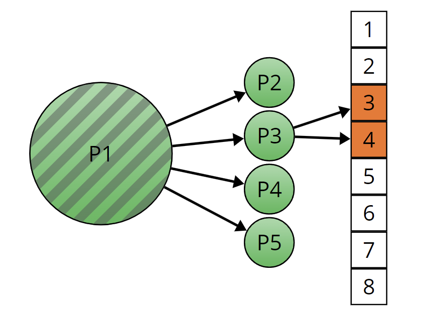

# Operating Systems - Assignment 1
**Processes and Scheduling in xv6**

## Overview
This project is part of the Operating Systems course at BGU (Spring 2025).  
We extend the **xv6-riscv** operating system by implementing userspace programs, system calls, and modifying kernel behavior related to processes.

## Tasks
- **Task 0:** Set up a Dev Container using Docker and VS Code, and run xv6 inside QEMU.
- **Task 1:** Write a userspace program `helloworld.c` that prints "Hello World xv6".
- **Task 2:** Implement a `memsize()` system call that returns the running process's memory size and test it with `memsize_test.c`.
- **Task 3:** Extend `exit` and `wait` to handle custom exit messages. Update the shell (`sh.c`) to display the messages. Write userspace program `goodbye.c` to test it.
- **Task 4:** Implement `forkn()` system call to fork multiple processes and `waitall()` system call to wait for all children. Write userspace program `bigarray.c` to split an array processing task among multiple processes.

## Assignment Intraction and How to Run
[os252-assignment1](resources/os252-assignment1.pdf)

## Acknowledgments
[xv6_README](xv6_README)

 